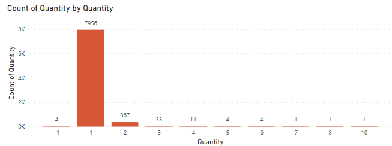

## Overview
-	Deadline is **Thursday, 30th January 2025, 12:00pm**
-	Your report should encompass **insights, visualizations, etc.**, presented **using Power BI, highlighting your skills with the tool**. The **content** and **presentation** of results will be evaluated.
-	Dedicate approximately 2-4 hours to this task. While you have the liberty to choose your preferred tool, please specify the use of Power BI. If any coding is involved (e.g., in R), include it in the final report but exclude it from the 2 standard A4 pages limit.
-	The reservations dataset contains arrivals during the first week of October for two properties, while the folio invoices dataset includes expenses per reservation from the first set. **Begin with an exploratory data analysis, employing *statistical* tests to uncover correlations between features**.
-	The data should be self-explanatory with headers providing sufficient context. In case of any ambiguity, document your queries and make reasonable assumptions where necessary, recording these assumptions before proceeding with the analysis. If an answer is crucial and unobtainable, feel free to reach out via email.

## Steps taken
1.	Load data into Power BI
    1. Changed certain column names, table names, data types
    2.	Added ct column to FACTs (I use this column when I aggregate the table. Its purpose is purely to simplify the measures)
2.	Added DIM Date table and Measures table
3.	Created GitHub Kanban board (GitHub project to track my work)
4. Performed EDA of reservations
   1. Overview of the data
      1. 3,234 reservations from 3,034 guests. 
      2. Some reservations are duplicates, when I checked, all variables were the same apart from reservation number (e.g. reservations 38 through to 44 are for the same person). **Duplicates were removed in Power Query.** I checked the line orders, they are also duplicated for each error reservation, hence removing the duplicate is safe, all line orders can still be joined to the reservation.

        1. Some reservations seem to be from the same person who booked a 'split trip' or extended their trip (e.g. guest id = 22762). Some people have booked twice and cancelled one of the trips (e.g. 5026381, 5145706). Some people have changed (assumption) the number of people on the reservation and both reservations have been recorded (e.g. 5130415). 
   1. Categorical variables
      1. Histograms to see the distribution of categorical variables
      2. Heat maps of categorical variables
   2. Continuous variables
      1. Added stay length 
         1. Actual arrival and departure times used, unless blank, then assumed arrival and departure times used
         2. Noticed stay length = 0 for a handful of data. Nothing much in common, booked on different dates, for different arrival times, from different sources. One notable thing is that it's mostly from Hotel1. 
            
           1. I assume most are data errors, like the example below. This guest was the only one with a duplicate record here showing the reason. This record was deleted from the data in Power Query.
             
5. Performed EDA of invoices
   1. 8,579 invoices at the start
   2. Knowing that some of the invoices are duplicated, I removed any invoices which didn't correspond to a reservation in the Reservations table. I was left with 8,382 invoices
   3. I looked into Quantity for the orders. There are 4 invoices when the quantity is -1 and they're all food orders. This could be a missing field, which was replaced with -1 or an error where a minus was added by accident. The chances that this is a 1 are the highest, so I've **replaced these with a 1**. 

    4. I then looked into the Total column. 
       1. I realised that the total is already multiplied by quantity, so I changed my measure Total Quantity from SUMX() to a regular SUM(). 
       2. I also noticed a big spike in a value 13.95 euro, which was Breakfast prebooked. I reconciled Breakfast prebooked and Prebooked Breakfast Menu to Breakfast prebooked.
       3. I noticed Total = 0 for some Breakfast prebooked. I changed the value in PQ to be 13.95 * number of persons.
       4. I reconciled Breakfast on the day and On the day Breakfast Menu to Breakfast on the day.
       5. I inspected the negative Total values. The ones with a word 'Discount' I left as they were. The ones which were negative and looked like normal transactions, I multiplied by -1 to make them positive.
6. Data modeling
   1. Added a DIM Date table with dates
   2. Added a Measures table
   3. Connected (FACT) Reservations Arrival Date to DIM Date with an active relationship. All other dates have an inactive relationship to DIM Date [Date]
   4. Connected FACT Reservations and FACT Invoices on Reservation Id. There is no ambiguity in the model as all relationships follow in the same direction. I treated the invoices as an 'extension' of the Reservations.
7. Overview page
   1. Is my hotel booked at a stable rate? Events in progress show open reservations per date period (https://www.daxpatterns.com/events-in-progress/).
   2. We can also see if we lost a lot of bookings, and if we do, are they short or long-stay visits? Does the party-size matter? 
   3. I can also inspect my booking window based on the reservation source filter. 
   4. What are the trends in my revenue based on the party size and reservation source?
8.  Customer page
       1. Focuses on returning customers versus revenue
       2. Do my customers return? That is good to know together with the revenue. So, does my revenue increase the more visits I have? 
       3. If yes, then I might want to think of incentives like discounts for the next stay.
       4. But if no, then you might want to focus on a good experience to keep your reviews high, but also give incentives to new customers, like free drinks/food/breakfast discount
       5. For this, the analysis of items is needed, so we know what is most popular for 1st/2nd/3rd visit and we can adjust our incentives accordingly.
       6. Addionally, we can also look at stay length to see how revenue streams peak/drop based on how long the guest is staying. We can then offer different approach to different clients.
