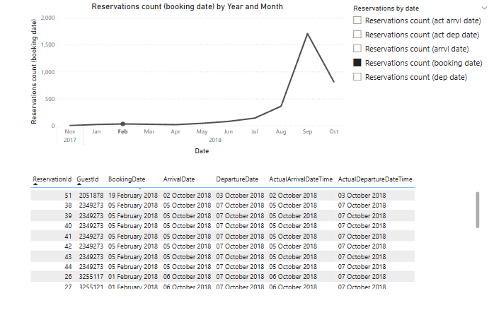

## Overview
-	Deadline is **Thursday, 30th January 2025, 12:00pm**
-	Your report should encompass **insights, visualizations, etc.**, presented **using Power BI, highlighting your skills with the tool**. The **content** and **presentation** of results will be evaluated.
-	Dedicate approximately 2-4 hours to this task. While you have the liberty to choose your preferred tool, please specify the use of Power BI. If any coding is involved (e.g., in R), include it in the final report but exclude it from the 2 standard A4 pages limit.
-	The reservations dataset contains arrivals during the first week of October for two properties, while the folio invoices dataset includes expenses per reservation from the first set. **Begin with an exploratory data analysis, employing *statistical* tests to uncover correlations between features**.
-	The data should be self-explanatory with headers providing sufficient context. In case of any ambiguity, document your queries and make reasonable assumptions where necessary, recording these assumptions before proceeding with the analysis. If an answer is crucial and unobtainable, feel free to reach out via email.

## Steps taken
1.	Load data into Power BI
    1. Changed certain column names, table names, data types
    2.	Added ct column to FACTs
2.	Added DIM Date table and Measures table
3.	Created GitHub Kanban board
4. Performed EDA of reservations
   1. Overview of the data
      1. 3,234 reservations from 3,034 guests. 
      2. Some reservations are duplicates, when I checked, all variables were the same apart from reservation number (e.g. reservations 38 through to 44 are for the same person). **Duplicates were removed in Power Query.** I checked the line orders, they are also duplicated for each error reservation, hence removing the duplicate is safe, all line orders can still be joined to the reservation.

        1. Some reservations seem to be from the same person who booked a 'split trip' or extended their trip (e.g. guest id = 22762). Some people have booked twice and cancelled one of the trips (e.g. 5026381, 5145706). Some people have changed (assumption) the number of people on the reservation and both reservations have been recorded (e.g. 5130415). 
   1. Categorical variables
      1. Histograms to see the distribution of categorical variables
      2. Heat maps of categorical variables
   2. Continuous variables
      1. Added stay length 
         1. Actual arrival and departure times used, unless blank, then assumed arrival and departure times used
         2. Noticed stay length = 0 for a handful of data. Nothing much in common, booked on different dates, for different arrival times, from different sources. One notable thing is that it's mostly from Hotel1. 
            
           1. I assume most are data errors, like the example below. This guest was the only one with a duplicate record here showing the reason. This record was deleted from the data in Power Query.
             
5. Performed EDA of invoices
   1. 8,579 invoices at the start
   2. Knowing that some of the invoices are duplicated, I removed any invoices which didn't correspond to a reservation in the Reservations table